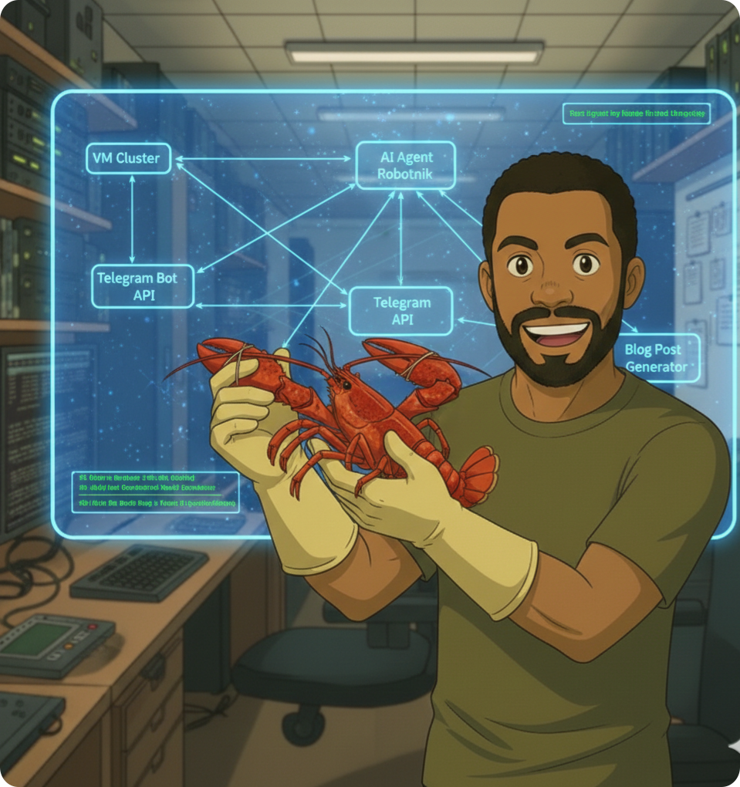

## Introduction

So you want to build an AI bot that can be your digital assistant and make life easier? Great, we've got a lab here for you.

But slow down, friend! Before you just install an autonomous robot into the root of your systems and give it the keys to your entire digital life, let’s arm you with a little information first. I've created this guide as an "easy mode" tutorial for people who want to use AI but don't exactly understand the "how" behind it. I'll give you a few key terms and system requirements before we proceed.
Terminology

LLM (Large Language Model): Think of this as a massive, mathematical library. It’s a giant file trained on billions of patterns to predict the next logical word or piece of code. By themselves, LLMs are "stateless," meaning they are pretty useless to humans. They have no memory, no hands, and no way to see the real world. It’s basically like being the smartest person in the world, but your world happens to be a sensory deprivation tank. You're likely already familiar with models like ChatGPT-4, Gemini 3, or Llama 3.

Generative AI: If the LLM is the "Big Brain" behind AI, then Generative AI is how we give that brain its voice. It uses those mathematical patterns to synthesize responses that feel near-human. It’s not just for text anymore; it can generate images, code, and even logical workflows. However, even this has its limits—Generative AI does nothing unless prompted by a human to do so. Kinda lame...

AI Agents: This is the "Jarvis" level AI sci-fi fans and comic book lovers have been waiting for. Unlike a standard chatbot that just waits for you to type, an AI Agent is an autonomous layer that sits on top of the LLM. It can identify a goal, plan the steps to reach the intended outcome, and execute "skills" (like running a Python script, checking your server's disk space, or scanning your network) without you holding its hand.

## System Requirements: The Reality Check

Currently, the "golden boy" of the AI world is the Mac Mini M4 Pro. It was basically made for this stuff. I could go over the specs, but then you would see the cost: $1,300, if not more. Let's come back down to Earth where most of us "normies" live and look at what you actually need to build this in your own lab.

**The Processor (CPU):** Minimum 8 Cores / 16 Threads (Intel i7 or Ryzen 7). Clock speed isn't as important here; you just need enough "lanes" (threads) so your OS doesn't stutter while the agent is busy thinking.

**Memory (System RAM):** 16GB is the bare minimum, but for 24/7 operation, 32GB is the sweet spot.

**VRAM (GPU Memory):** This is what makes the AI "snappy." If your model doesn't fit in the VRAM requirement, it will be slow and choppy. I'll just tell you: you need at least an RTX 3090 if you really want to play.

## Alternative to a Local Build

Building a local LLM is cool, but expensive. If your current rig isn't up to the task, you can still host the AI Agent at home while using an LLM that lives in a Cloud Provider's data center. OpenClaw sends an API Call to a provider like OpenRouter, Anthropic, or Google Gemini.

You get the smartest brains for pennies per day (or even for free on some tiers). This removes the hardware barrier; you can operate an agent on a system with as little as 4 cores, 8GB of memory, and no GPU. Note: You do trade off some privacy and require a constant internet connection for this route.
STEP 1: The Environment (Virtual Machine)

The VM we place the Agent in needs to be stable, lightweight, and secure. For my lab, I chose an Ubuntu Server VM living on its own VLAN with a dedicated vSwitch connection.

* **vCPU: 4 Cores**

* **RAM: 8GB**

* **Storage: 50GB**

* **Network: Isolated VLAN**

Note on Security: I isolate my agent because I don't need it touching my core home network. If your agent is compromised, you want to limit the attack surface and blast radius it can effect. If you need your agent to troubleshoot your router or IoT devices, you'll need to adjust this, but at a minimum, keep it away from sensitive management subnets.

## STEP 2: Dependencies

Before installing the main software, run a system check and install these essentials:
```
#Pre-flight Check
    sudo apt update && sudo apt upgrade -y
    sudo apt install -y curl git build-essential
```
Next, install Node.js (v22+) via NVM and Docker:
Bash
```
#NVM Install
    curl -o- https://raw.githubusercontent.com/nvm-sh/nvm/v0.40.3/install.sh | bash
    source ~/.bashrc
    nvm install 24
```
```
#Docker instll
  curl -fsSL https://get.docker.com -o get-docker.sh
  sudo sh get-docker.sh
```
## STEP 3: The Wizard

Finally, head to openclaw.ai for the one-line install wizard. It walks you through everything, from setting up Telegram so your bot can text you, to connecting your API keys.
## Closing

So, what do you plan to do with your bot? The use cases are wide open. From negotiating car discounts to automating grocery deliveries, the potential is huge. I personally have mine connected to Google Places, Notion, and Gemini via Telegram. It leaves me notes on blog ideas and hunts for travel deals while I sleep.

There is even a viral sensation where agents are joining a social platform called Moltbook to "discuss" things with other AIs and their human overlords. I think that's mostly a marketing plot, but it's pretty funny stuff if you're wanting to see just how far this "Jarvis" future can go!
    
     

