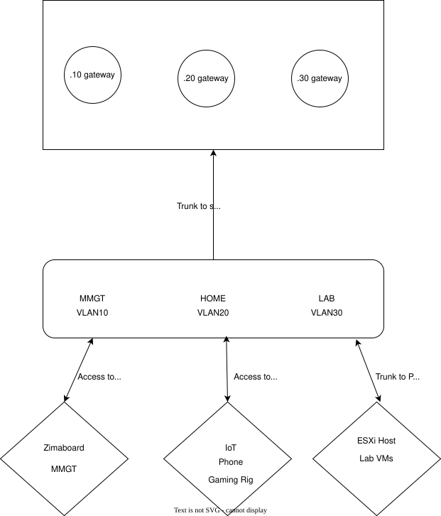

## Description

This are the basic network architecture that I use for my home network. This is a SOHO (small office, home office) style network so the complexity
and nature of the design are not at a very high level, but in creating this document I gave myself a chance to work with several different network diagraming tools
to include Mermaid.js, Draw.io, and Microsoft Visio. Mermaid is a Diagram as Code approach which I believe is superior in a network like mine that can have constant changes
at a fast pace. While Draw.io is used for more executive overview briefs for high-level explainations to cilents or non-technical personnel. 
Microsoft Visio is general diagraming tool that is suitable for technical daigrams, relations charts, system modeling and more but I can be expensive outside 
of use in work setting. I have a physical, logical, and data infrasturcture using the two diagram styles. These are 3 examples of 3 different types of diagraming tools 
I'd like to get familiar with. I won't be too detailed in this schematics by leaving out specific information for my own security and peace of mind. This should serve as an example of my diagraming skills

## The Architecture

The 12 port switch I have is the backbone of my infrastructure it does most of the heavy lifting both in network segementation as well as traffic handling on my LAN.
I've taken my ISP provided router and switch it out with my firewall this allows me to create rules for how traffic is handled across my subnetworks. I've also repurposed
the router and configured it into bypass mode so that I can use it as a wireless access point.

The layer 2 infrastructure is set in a router on the stick style topology. Thanks to this I am able to create firewall rules that block and allow traffic between subnets.
This is the simplest and fastest way you can set up a SOHO LAN. I've created 3 subnets one for the managment of the network, another for the daily home use of myself and guess, 
as well as another network were my lab lives. I use a port channel group that trunks to my ESXi server so that my VMs can be managed as well some I use with my home subnet like my 
TRUNAS-SCALE VM, other are placed on my management network like my DNSAdblocker. 

---

##  **Physical Network Topology:** Cabling Diagram


graph TD
    %% Define Nodes with Icons/Shapes
    Internet((ISP))
    Modem((Modem))
    
    subgraph "Headend"
        FW[Firewall]
        SW[Switch]
    end

    subgraph "Services & Virtualization"
        Zima[ZimaBoard]
        ESXi[ESXi Host]
        WAP[WAP]
    end

    subgraph "Clients"
        Laptop(Network Management)
        Desktop(Gaming/Prod)
    end

    %% Physical Connections with Port Labels
    Internet --- Modem
    Modem ---|"WAN"| FW
    
    FW ---|"Port 12"| SW
    
    SW ---|"Port 11"| Zima
    SW ---|"Port 10"| WAP
    
    %% LAG / Port Channel Group 1
    SW ---|"Port 8"| ESXi
    SW ---|"Port 9"| ESXi
    
    SW ---|"Port 1"| Laptop
    SW ---|"Port 2"| Desktop

    %% Styling for clarity
    style FW fill:#e67e22,stroke:#333,stroke-width:2px
    style Zima fill:#228B22,stroke:#333
    style ESXi fill:#69f,stroke:#333
    style Desktop fill:#1793d1,stroke:#333,color:#fff


---

## **Layer 2 Topology:** Logical Diagram

