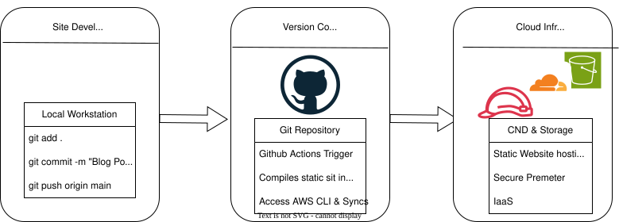

## Description
This is a CI/CD pipeline used to eliminate the manual deployment of the code for The C2 Homelab. This not only creates an automated workflow it also provides version-control, immutablility, and high-avalibility.

## The Architecture
Obviously because this is a personal site managed and operated solely by myself The workflow follows a lean and standard "Code-Build-Deploy" pattern, leveraging Git, Cloudflare as the edge delivery network,
 and AWS S3 buckets to host it out to the world with IaaS for literal pennies on the dollar compared to $90 subscription fee from some hosting provider.

### Step 1: Local Development
 I author in content in **Markdown** using an IDE, AstroNvim,  on my local Arch  workstation. Hugo's local server is used to verify CSS rendering and Blowfish theme logic. This was the simplest and fastest way
to achieve the build at the time Hugo requires very low code experience and knowledge to operate, but with just enough difficulty that it leaves room for some learning to take place on file structures, and syntx.

### Step 2: Version Control (GitHub)
Once verified, changes are pushed to my  GitHub repository. This serves as the "System of Record" and the trigger for the automation suite. For now only my linux workstation has keys to perform this push,
however I'll be adding keys for my laptop as well to so that I can post on the site during times of travel. I've added extra passphrases as a security precaution. 

### Step 3: Automation (GitHub Actions)
I've added GitActions that trigger upon a push to the `main` branch, GitHub Actions runner executes the following:
* **Checkout:** Pulls the repository and initialises submodules (Blowfish theme).
* **Environment Setup:** Installs the Hugo Extended binary.
* **Build:** Compiles the static site into the `public/` directory with `--minify`.
* **Sync:** Uses the AWS CLI to sync the `public/` folder to the target S3 bucket, deleting stale objects to keep the footprint lean.

This makes it so that I don't login or interact with the AWS console manually, it eliminates the toil of actually needing to do anything outside of my terminal.
 
### Step 4: Storage (AWS S3)
The site is hosted in a standard S3 bucket configured for **Static Website Hosting**. This serves as the "origin" for the architecture. While self-hosting from my home is an option, by using AWS's S3 buckets,
I've eliminated the need for server patching, OS managment, hardware maintence (outside of my workstations), and disaster recovery. This infrastructure is basically just a serverless storage backend.

##Step 5: Edge Networking & Security (Cloudflare)
Cloudflare sits at the edge, serving as the primary gateway for my domain **cailshomelab.com**. 
* **DNS & SSL:** Cloudflare manages the DNS records and provides Full (Strict) SSL encryption between the client and the S3 origin.
* **Caching & CDN:** By utilizing Cloudflare's Global Edge Network, assets are cached geographically closer to the user, reducing latency and offloading requests from the S3 bucket. My site will operate at ms
speeds globally.
* **Page Rules:** I've implemented specific cache rules to ensure that while the site is fast, updates to the `index.html` are reflected quickly after a new CI/CD deployment. 

This way even if, and its a big IF, there was a time of outage the sites most recent cache would still be avalible to user. And in theory it would be lightning  fast no matter where they are accessing it from.

## Technical Lessons
Transitioning from manual SC uploads to my first structured CI/CD pipeline forced me to practice **IAM policies**, **GitHub Secrets**, and **Git Actions**. Security was prioritized by using a dedicated IAM user 
with the Principle of Least Privilege (PoLP), restricted only to the specific S3 bucket's ARN. If for some reason my site is compromised I wont have to worry about it spreading beyond the bucket itself or leading
back to my workstations.

**NOTHING FOLLOW**
